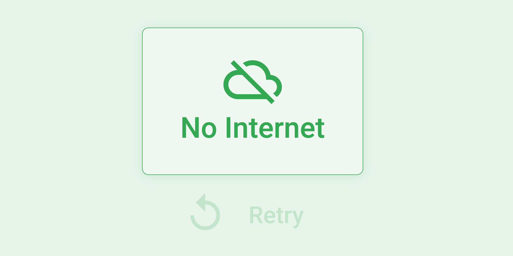
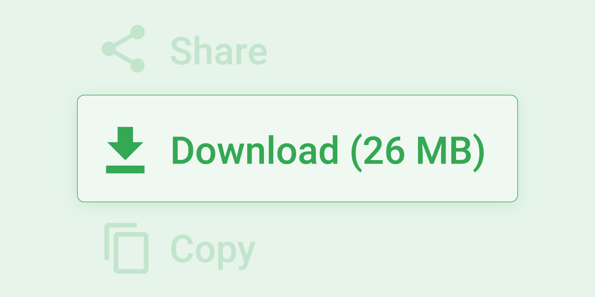
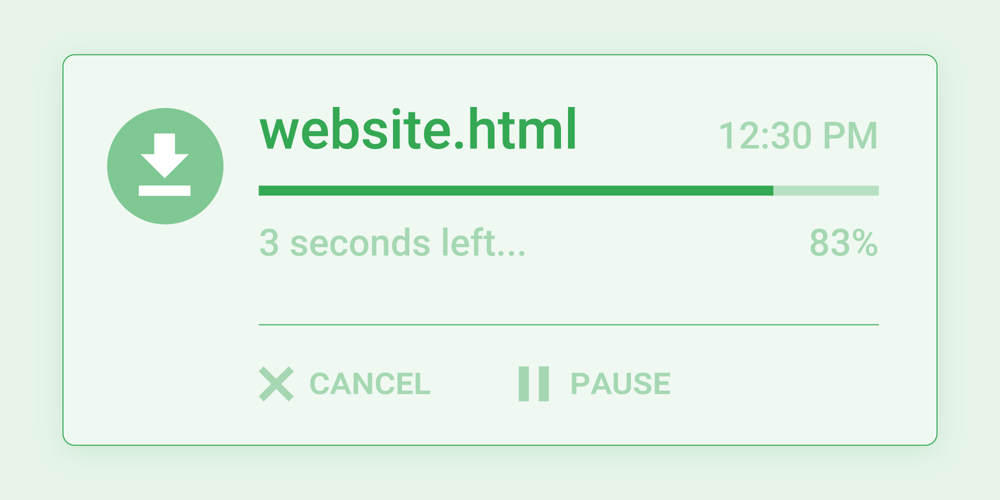
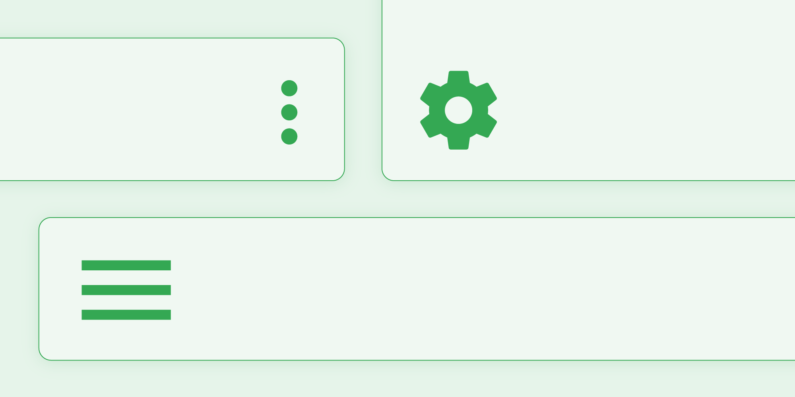
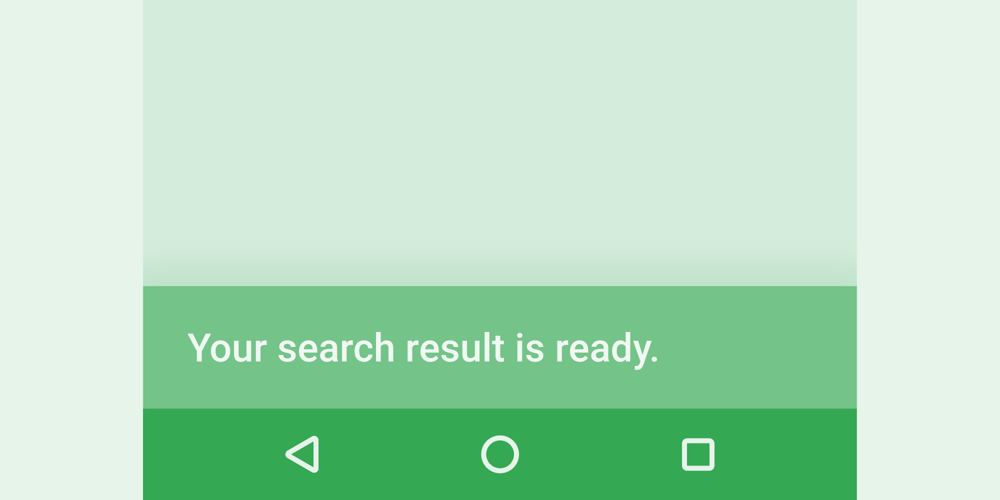

# Design for Offline

**Material Design Guidelines**

1. **Clearly indicate offline funcationality**

   

   - Display the offline pin icon paired with the word "offline" to indicate that an app can be used offline
   - Show the icon if the user has downloaded content for offline use but is still online
   - Show an offline icon when the user is offline

2. **Display No Functionality**

   

   - A cloud off icon with "no internet" can communicate no online functionality exists

3. **Allow downloading for future use**

   

   - Indicate content can be downloaded for future offline use witha download icon, the text "download" and the size of the file.
   - Make it easy to delete files as well. Display a remove action with a delete icon for downloaded files. Show how much space can be saved by deleting the file.

4. **Transition from downloading to offline-ready**

   

   - Use an animation to show a file being downloaded and when it's ready for offline use.
   - Display how many seconds it will take to download.
   - Enable the user to pause the download.
   - Communicate when the download is complete.

5. **Make offline file location discoverable**

   

   - Consider making a tab or button on the home screen that helps users easily find all of their offline files.

6. **Notify users when connection is restored**

   

   - You can queue search queries, messages, or content up until the connection is restored. Notify the user that content is waiting for them.

7. **Offline states offer opportunities for delight**

   - Challenge yourelf to reimagine the offline state and still provide content that can be useful or delightful

