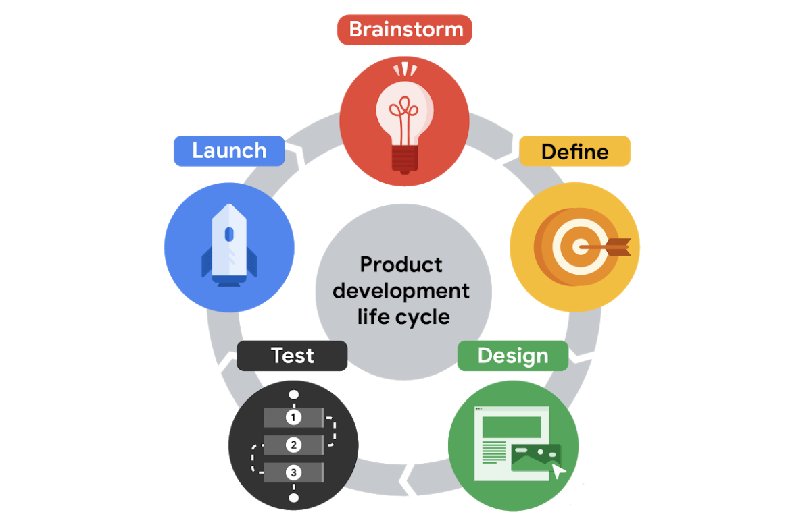

# The Product Development Life Cycle

### 1. Brainstorm

Think of an idea for a product. There might be a user problem to solve. 

Make sure the brainstorming team is diverse across identifiers like race, gender, abilities, family structure, and ethnicity. This makes brainstorming mor effective because it brings together a lot of different lived experiences. 

Check out your product's competitors. See if there's a solution already out there. You want your product to fill a gap in the market, not solve a problem that’s already being successfully addressed by another company. 

### 2. Define

UX designers, UX researchers, program managers, and product leads come together to **define** the product. Figure out the specifications for the product. Who is the product for? What will the product do? And, what features need to be included for the product to be successful? 

Narrow your focus. You can't solve every problem.

Research is key. You can’t assume you know what problems users are experiencing without asking the users directly. 

### 3. Design

UX designers build out the ideas for the product with wireframes, then prototypes (early models to covey funtionality).

UX writers may write copy within the wireframes and prototypes.

UX designers make sure to include all of the product specifications that were outlined in the define stage. They check to see that they fit in an intuitive way. They also make sure that each task a user needs to complete is clear and easy to understand.

### 4. Test

UX designers work with engineers to develop functional prototypes that match the original designs.

Three phases of testing are conducted (typically the responsibility of the UX researcher):

- **Test the product internally.** Look for bugs and usability problems. Often referred to as beta testing. 
- **Test with stakeholders.** Does the product is align with the company’s vision? Is it accessible? Does it maintain privacy standards?
- **External test with potential users.** Does the product provide a good user experience?

If users are frustrated or confused by your product, UX designers make adjustments or even create new versions of the design. This can turn into a bit of a cycle.

### 5. Launch

The product is released into the world!

Start promoting via your marketing team. Customer support should have what they need to help new users learn how the product works.

Program managers may ask: What worked and what could be improved? Were goals achieved? Were timelines met? Making time for this reflection is super important, since it can help improve the process going forward. 

New problems may be found so after the launch stage, teams will often cycle back to the design and testing stages to start working on the next version of a digital product.