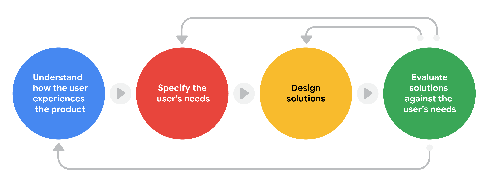
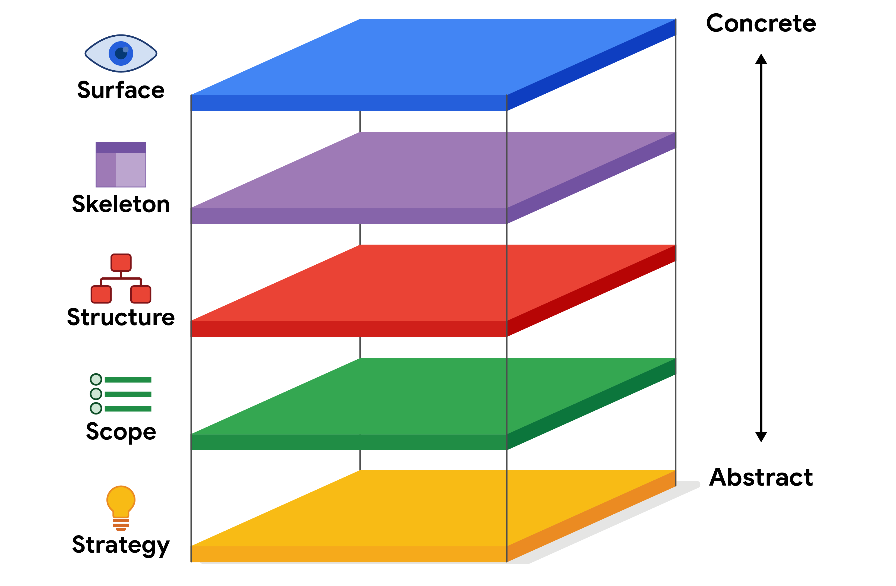
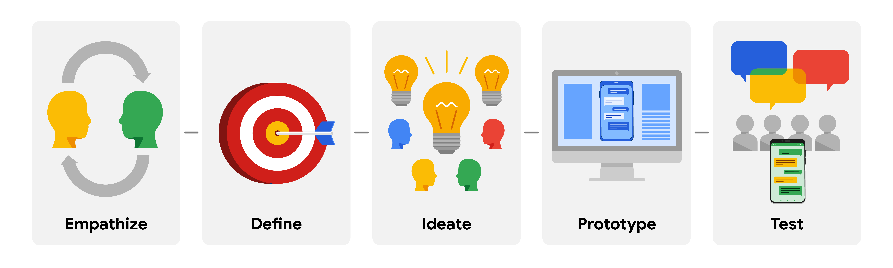
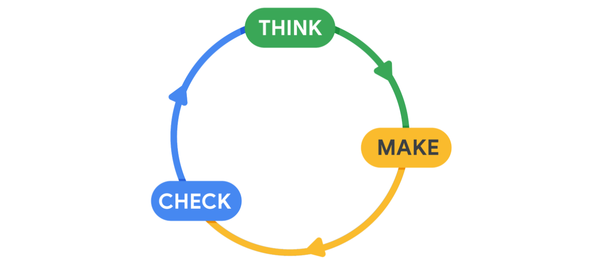
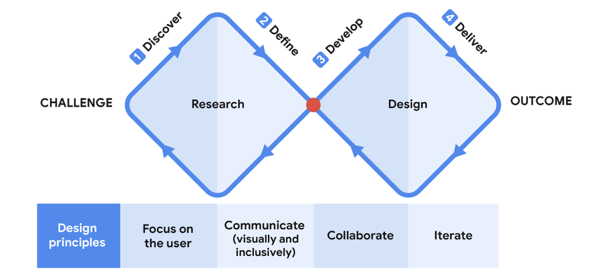
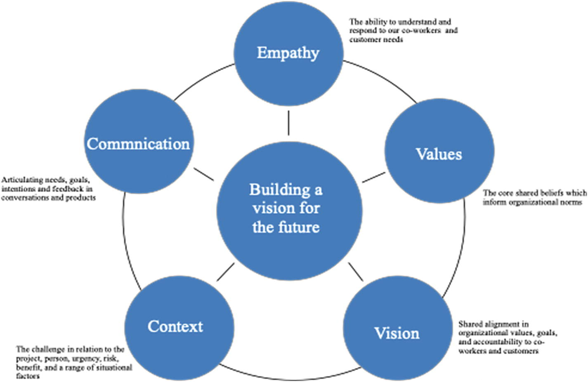
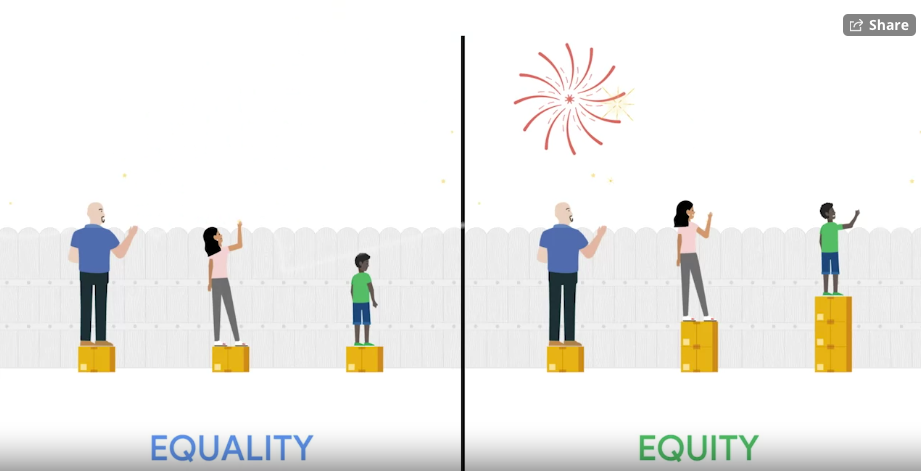

# Think Like a UX Designer

**Framework: ** Creates the basic structure that focuses and supports the problem you're trying to solve

## Key Frameworks in UX Design

### User-Centered Design

A framework that puts the user front-and-center. Consider their story, emotions, and the insights you've gathered about them. This is an iterative process. The core of this is empathy.

- Steps in the User-Centered Design Process:
   	1. **Understand** - How does the user experience the product? What environment are they in?
   	2. **Specify** - What end user problem is most important to solve?
   	3. **Design** - Come up with ideas for what the product may look like
   	4. **Evaluate** - Does your design solve the end user's problem?
 - Guiding Principles:
   1. **Design for users and their needs.** Remember, you are not the end user.
   2. **Make your copy conversational.** Should be a friendly, simple, easily accessible tone.
   3. **Present all information clearly.** Users should be able to navigate easily. Make key elements easy to find.
   4. **Acknowledge user actions.** Give feedback after an action.
   5. **Offer support.** Offer a safety net like an FAQ or a support center.

### Five Elements of UX Design

A framework of steps a designer takes to turn an idea into a working product

- Five layers, each one dependent on the one below it:
  1. **Strategy** - Define the user's needs and business objectives
  2. **Scope** - Determine what you're building. Features and content.
  3. **Structure** - Figure out how to organize your design and how the user will interact with it
  4. **Skeleton** - How does the design work? The user won't see these innerworkings
  5. **Surface** - How the product looks to the user

### Design Thinking Process

A framework for a way to create solutions that address a real user problem and are functional and affordable

- Five steps:
  1. **Empathize**: What do end users really need? Learn to think and feel like them.
  2. **Define**: Create a clear problem statement - a description of the user need that is being addressed. Should be based on user research. This will drive the team towards a clear goal.
  3. **Ideate**: Brainstorm solutions to the problem. Come up with as many ideas as possible.
  4. **Prototype**: A scaled down version of a product that shows important functions.
  5. **Test**: Test the prototype for feedback before the product is built.

### Lean UX

A framework that focuses on reducing wasted time and resources and produces a workable product as soon as possible. Iterative process. 

- Three steps:
  1. **Think**: What problems is the user facing? Research to form a clear idea of who the product is for and how it will help them
  2. **Make**: Create sketches, wireframes and prototypes. Create an MVP prototype that can be tested. 
  3. **Check**: Test users and gather feedback from project stakeholders. Adjust what's necessary.

- Six Principles:
  1. **Move forward.** Don't get distracted by "nice-to-haves." Move the design towards the goal.
  2. **Stay curious.** The point is to get feedback from users and stakeholders. Seek feedback as to why specific design choices work or don't work.
  3. **Test ideas in the real world.** Test ideas with prototypes
  4. **Externalize your ideas.** Turn your ideas into something physical while they're still fresh in your mind, to get feedback in early stages.
  5. **Reframe deliverables as outcomes.** Focus on creating enjoyable products users want and need. You're creating for users, not project stakeholders.
  6. **Embrace radical transparency.** You depend on your team's insights. Be comfortable and honest.

### Double Diamond

A framework which breaks UX design into two main phases: research and design.

- Four steps:
  1. **Discover the problem**: Get info on issues users are facing.
  2. **Define the problem**: Filter through data and focus on the main issue your product aims to solve.
  3. **Develop solutions for the problem**: Design your product as a work in progress using wireframes and prototypes.
  4. **Deliver the product**: Review and test your product
- Four Principles:
  1. **Focus on the user.** 
  2. **Communicate.** Use imagery. Make it equitable and accessible. 
  3. **Collaborate.** This framework encourages collaboration and co-creation.
  4. **Iterate.** Accept that the design is a work in progress. The magic is in the revision.

### EVVCC Framework

- **Empathy**: The ability to understand and response to our co-workers and customer needs

- **Value**: The core shared beliefs which inform organizational norms

- **Vision**: Shared alignment in organizational values, goals, and accountability to co-workers and customers

- **Context**: The challenge in relation to the project, person, urgency, risk, benefit, and a range of situational factors

- **Communication**: Articulating needs, goals, intentions, and feedback in conversations and products

  - What is the overall goal of the product and are you addressing your users' needs in correlatin to that?

  ****

## Universal Design, Inclusive Design, and Equity-Focused Design

**Universal Design:** The process of creating one product for users with the widest range of abilities and in the widest range of situations.

- "One size fits all."

- Unfortunantly, this causes the designs to lose their effectiveness 
- It can exclude a lot of people. One-size-fits-all isn't a good solution.

**Inclusive Design:** Making design choices that take into account personal identifiers like abilit, race, economic status, language, age and gender

- You must include researchers and designers from traditionally excluded populations in the process
- "Solve for one. Extend to many."
- No one should be excluded from using a product that we built because we didn't consider their needs while building it.
- There's no average person that we should design for.
- We focus on the needs of people who are blind and deaf even more than people who have sight and hearing.
- **Accessibility:** The design of products, devices, services, or environments for people with disabilities. 
- Unfortunantly, many groups are still left out. This design only benefits the group the design was created for.

**Equity-Focused Design:** Designing for groups that have been historically underrepresented or ignored when building products. This is the new industry goal. The goal is to uplift these marginalized groups.

It is thinking through all the aspects of a designed product and making sure the product is both accessible and fair to all genders, races, and abilities.

Plus, the designs need to specifically consider underrepresented and excluded groups.

- Equality vs Equity:

  ​	

  - **Equality:** Providing the same amount of opportunity and support
  - **Equity:** Providing different levels of opportunity and support for each person in order to achieve fair outcomes.

- Build your design while keeping the groups who identified as underrepresented front and center.

- Still won't solve all of your problem.

**Additional Reading**

- [Benjamin Evans: The power of inclusive design](https://www.designbetter.co/podcast/benjamin-evans) - An episode of the Design Better Podcast
- [How to design and manage equity-focused evaluations](https://evalpartners.org/sites/default/files/EWP5_Equity_focused_evaluations.pdf) - UNICEF, focused on pages 18-24 about “What is equity and why does it matter?”