# Hardware

[Connector Resource](https://juicedsystems.com/blogs/news/know-your-usb-a-practical-guide-to-the-universal-serial-bus)

### Basic Anatomy of a Computer

These exist in all computers--from desktop to mobile phone:

​	**Ports**: Connection points that we can connect devices to that extend the functionality of our computer. Ports exist for monitor, 	keyboard, mouse, network, etc..

​	**CPU (Central Processing Unit):** The brain of our computer, it does all of the calculations and data processing. It communicates 	heavily with RAM.

​	**RAM (Random Access Memory)**: The computer's short-term memory.

​	**Hard Drive**: Holds all of our data, which includes all our music, pictures, applications.

​	**Motherboard**: The body or circulatory system of the computer that connects all of the pieces together.

​	**Power Supply**: Converts electricity from an outlet to a form that the computer can use.

### Programs and Hardware

**Programs**: Instructions that tell the computer what to do. They are stored on hard drives. Copies are put into RAM where the CPU can access it faster than it could with the hard drive.

**External Data Bus (EDB)**: A row of wires that interconnects the parts of our computer. It's how we send our 1s and 0s. These come in different sizes - 8, 16, 32 or 64-bit. 

**Registers:** Components inside the CPU that lets us store the data that our CPU works with (its calculations).

**Memory Controller Chip (MCC)**: A bridge between the CPU and the RAM. It grabs the data that is needed by the CPU and sends it through the EDB.

**Address Bus**: Connects the CPU to the MCC, to send the location of the data. The MCC takes the address and looks for the data, then sends it over the EDB.

**Cache**: Used by the CPU. Lets us store data that is used often. There are three cache levels in a CPU: L1, L2, and L3--L1 being the smallest and the fastest cache. [GPU Cache](https://en.wikipedia.org/wiki/CPU_cache)

**Clock Wire**: Our CPU has an internal clock that keeps operations in sync. It is connected to this wire. When you send or recieve data, it sends a voltage to the clock wire to let the CPU know that it can start doing calculations. Each jolt of voltage is known as a clock cycle. Lots of data to process = lots of clock cycles. 

**Clock Speed**: The maximum number of clock cycles that a CPU can handle in a certain time period. `3.40ghz` is an example of a clock speed. 3.40 gigahertz = 3.4 billion cycles per second.

**Overclocking**: Increases the rate of a CPU clock cycle in order to perform more tasks. Commonly used to increase performance in low-end CPUs. Unfortunantly this may overheat your CPU. [How to Overclock Your CPU](https://www.digitaltrends.com/computing/how-to-overclock-your-cpu/)

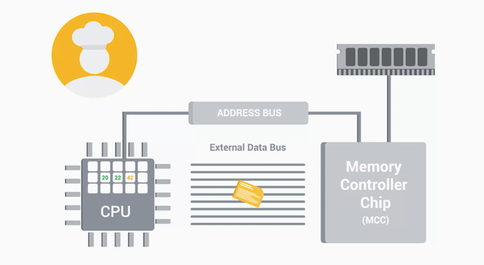

### CPU

The CPU uses an **Instruction Set** to translate and perform functions on our data. Different CPU manufacturers (e.g. Intel, AMD, Qualcomm) may use different instruction sets, but they generally perform the same functions.

The CPU you select must be compatible with your motherboard.

There are two types of CPU sockets:

	- **Land Grid Array (LGA)** - pins stick out of the motherboard
	- **Pin Grid Array (PGA)** - pins are located on the processor itself

CPUs are prone to overheating. You need a **heat sink** which takes the heat from the CPU and dissipates it through a fan or another medium.

CPUs have either a **32-bit** or **64-bit** architecture. It specifies how much data it can officially handle.

### RAM

There are lots of types of RAM, and the one that's most commonly found in computers is **DRAM (dynamic random-access memory)**. When a 1/0 is sent to DRAM, it stores each bit in a microscopic capacitor. These semiconductors are put into chips that are on the RAM and store our data.

There are different types of memory sticks that DRAM chips can be put on. The more modern **DIMM** sticks, which usually stands for **Dual Inline Memory Module**, have different sizes of pins on them. 

Later, **SDRAM (synchronous DRAM)** was created. This RAM synchronizes to the system's clock to allow quicker processing of data. Today, we use **DDR SDRAM (double data rate SDRAM)**, often referred to as **DDR (DDR1-DDR4)**. It it faster, uses less power, and has a larger capacity than SDRAM. We are now on DDR4.  

The RAM you select must be compatible with your motherboard. The pins need to align.

### Motherboards

Every motherboard has:

 - **Chipset**: It decides how components, like the CPU, RAM, and peripherals (external devices), talk to each other. It is made up of:
   	- **Northbridge Chip:** interconnects RAM and video cards. Sometimes directly integrated into the CPU.
   	- **Southbridge Chip:** maintains I/O controllers (hard drives, USB devices)
	- **Expansion Slots:** Gives us the ability to increase the functionality of our computer. The standard for a slot is the **PCI Express (Peripheral Component Interconnect Express)**. The PCIe bus looks like a slot. The PICe base expansion card looks like a smaller circuit board.
	- **Form Factor:** The size of a motherboard. Determines how much stuff we can put in it. The most common is **ATX (Advanced Technology Extended)**, which comes in different sizes (full for desktop). Another option is **ITX (Information Technology Extended)**, which is much smaller.

### Storage

**Types of hard drives:**

- **HDD (Hard Disk Drive):** Uses a spinning platter and a mechanical arm to read and write information. **RPM (revolutions per minutes)** is used to measure the speed. e.g. 500 GB drive with 5400 RPM. 
  - Pro: Cheap
  - Con: Prone to damage
- **SDD (Solid State Drive):** No moving parts. Data is stored on microchips. It is a lot faster and smaller.
  - Pro: Less risky
  - Con: Expensive
- **Hybrid SSD/HDD:** Uses SSD when performance is needed (e.g. booting a computer).

Interfaces to connect a hard drive to your system:

- **ATA:** Most common. The most popular ATA drive is a **serial ATA (SATA)**. It uses a cable for data transfers. You don't even need to turn off your machine to swap a SATA drive (**hot swappable**).
- **NVMe (NVM Express)**: Keeps up the speed of SSDs. This drive is added an an expansion slot.

### Power Supplies

**Two types of electricity:**

- **DC (direct current)**: Used by computers
- **AC (alternating current**: What our power company gives us.

The power supply converts AC to low-voltage DC.

Most power supplys have a fan, a cable to power your motherboard, and a power cable.

**Voltage: ** The "pressure" of electricity. You can't plug a 120 V device into a 220 V outlet. Plugging a 220 V into a 120 V device can deteriote the device over time.

**Amperage:** The amount of electricity coming out. Amps pull as much electricity needed to power the device. Charging a device with 2.1a charger charges the device faster.

**Wattage:** The amount of volts and amps that a device needs. If you power supply has too low of a wattage, you won't be able to power your computer. A large power supply does not mean you will overpower your computer. Err on the side of larger. You can power most desktops with 500W. A  gaming computer could use more.

Power supplies can fail often.

### Mobile Devices

The smaller the device, the more integerted the components usually are. Things are often soldered into place.

Very small devices can use a **System on a Chip (SoC)**, which packs the CPU, RAM, and sometime storage on a single chip.

The physical shape of a device can make a standard port a band choice. Waterproof fitness trackers have custom ports.

**Some standard mobile connector types:**

- USB-C (the new universal standard for display and data transfer)

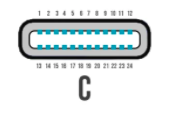

- Lightning

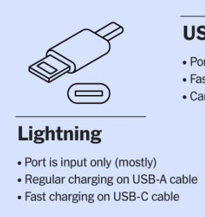

- USB 2.0 Mini A

- USB 2.0 Mini B

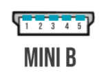

- USB 2.0 Micro A

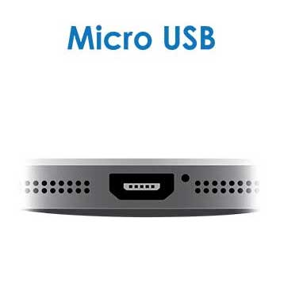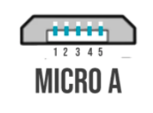

- USB 2.0 Micro B

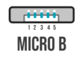

- USB 3.0 Micro B

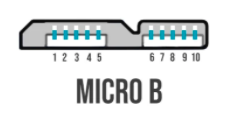

- Micro HDMI
- Mini HDMI
- Mini DisplayPort

### Batteries and Charging Systems

**Charge Cycle:** One full charge and discharge of a battery. Rechargeable batteries have a limited life span. End-of-life batteries may take longer to charge and may not hold a full charge. Some devices also start running slower once that battery reaches end-of-life (to make the battery last longer).

**Battery performance tips for iOS devices:**

- Update to the latest software for that latest energy saving tech
- iPhone, iPad, iPod, and Apple Watch work best at 32° to 95° F, with the ideal comfort zone being 62° to 72° F. Don't expose it to temperatures higher than 95° F, which damages the battery. Too cold temperatures (under 35° F) temporarily decrease battery life. MacBook works best at 50° to 95° F.
- If a device gets hot during charging, remove it from it's case.
- When storing long term, leave it half-charged. Allowing it to discharge completely can make it fall into a deep discharge state, rendering it incapable of holding a charge. Charge it to 50% every six months.

**Battery performance tips for Macbooks**

- System Information > Power > Cycle Count for current cycle count. Check to see what your model's maximum cycle count is (MacBook Pro (Retina, 15-inch, Mid 2015) = 1000)

### Peripherals

**Peripheral:** Anything that you connect to your computer externally that adds functionality

**USB (Universal Bus System)**: a common connector

- **USB-A 2.0**: Transfer speeds of 480 Mb/s (black ports)

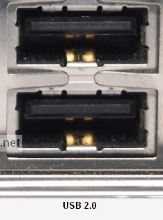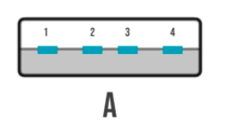

- **USB-A 3.0**: Transfer speeds of 5 Gb/s (blue ports)

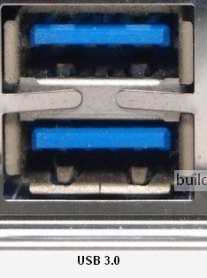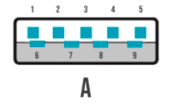

- **USB-A 3.1**: Transfer speeds of 10 Gb/s (teal ports)

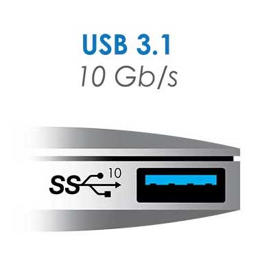

- **USB 4.0**: Transfer speeds of 20Gb/s
- **USB-B 2.0:**

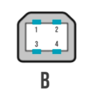

- **USB-B 3.0:**

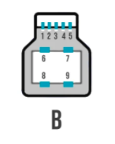

**Mb/s** is **megabit per second**. **Gb/s** is **gigabit per second**. These are **units of data transfer rate**. 

To transfer a 1MB file in a second, you need an 8 Mb/s connection speed.

To transfer a 40MB file in a second, you need an 320 Mb/s connection speed.

USB 2.0 has a bandwidth of 480 Mb/s, which is roughly 60 MB/s. It would take around 17 seconds to transfer 1024 MB of data.

USB 3.0 has a bandwidth of 5 Gb/s, which is roughly 625 MB/s. It would take around 2 seconds to transfer 1024 MB of data.

Plugging a USB 2.0 device into a USB 3.0 port means you won't get 3.0 transfer speeds.

**Display Peripheral Connectors:**

- **DVI**: Video output only

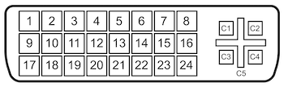

- **HDMI**: Outputs video and audio

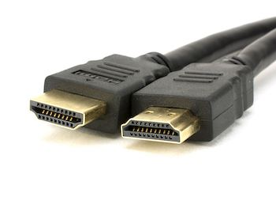

- **DisplayPort**: Outputs video and audio

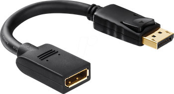

- **USB-C**: Transfers video, audio, data, and power.

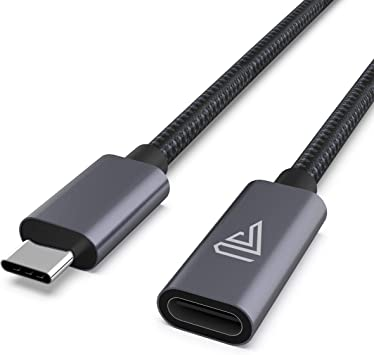

**Projector Peripheral Connectors:**

- **VGA**: Video output only

  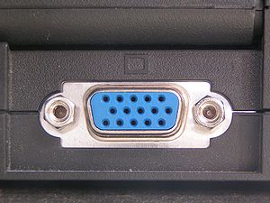

- **DVI**

- **HDMI**

- **DisplayPort**

### New Connectors

- **Thunderbolt 3**: USB-C with a lightning bolt symbol. Transfer speeds of 40 Gb/s. Powers one 4K display. 

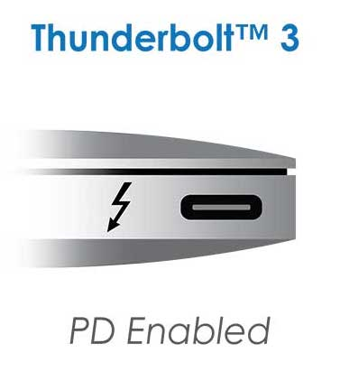

- **Thunderbolt 4**: USB-C with a lightning bolt symbol. Transfer speeds of 40 Gb/s. Powers two 4K displays. 